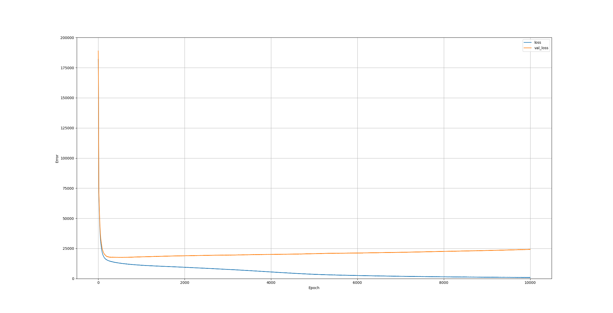
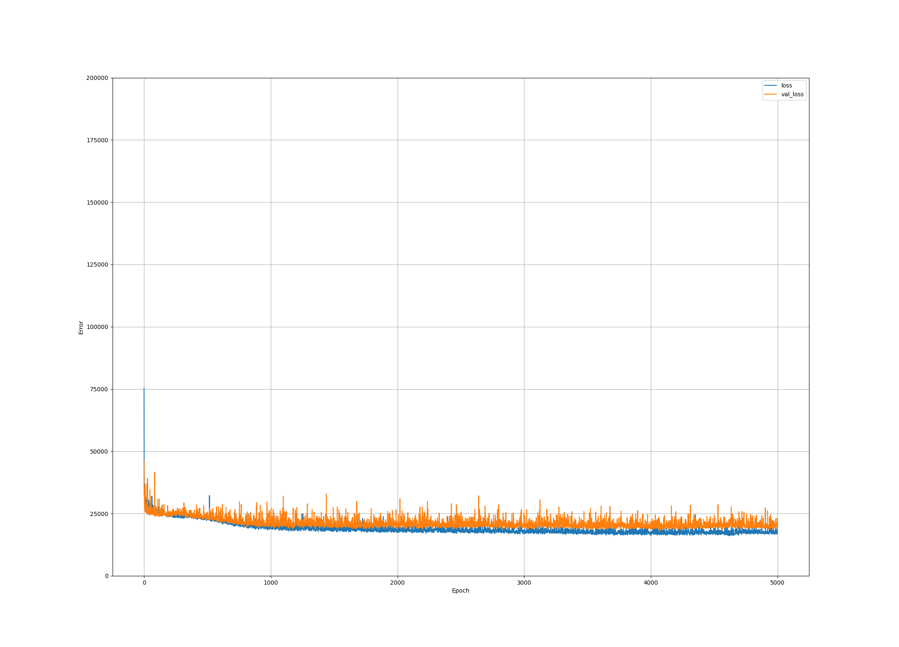

# Kaggle_AdvancedHousingPriceAnalysis
Attempt at analysis and prediction on this starter data set

After extensive hyper paramter tuning on relitively basic data cleaning methods, the model achieves roughly 10k absolute mean error on the test set for housing price. 
The model is still heavily over fitting the traning set as evidenced by the diverging residuals of the validation set. Though I did accidentally have the validation split twice, which I have fixed for much less overfitting, but have not rerun all the tuning yet.

# Training and Validation Losses

## 656 Perceptrons per layer, 20 layers deep, 0.01 learning rate

## 448 Perceptrons per layer, 10 layers deep, 0.1 learning rate

